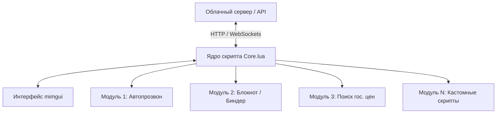

# Архитектура универсального игрового помощника для SAMP

Этот документ описывает концепцию и техническую архитектуру для создания **универсального модульного помощника (мульти-тула)** для SAMP на базе современного стека технологий.

---

## 1. Выбор технологий: Почему Lua (MoonLoader) — лучший выбор?

Вопреки расхожему мнению, **Lua** для SAMP — это не сложно. Это самый простой и гибкий способ создания модов на сегодняшний день. 

| Язык / Среда | Сложность | Возможности UI | Работа с сетью (Интернет) | Стабильность |
| :--- | :--- | :--- | :--- | :--- |
| **Lua (MoonLoader)** | **Низкая** | Отличные (ImGui / mimgui) | Отличные (HTTP запросы, JSON) | Высокая |
| **C++ (ASI)** | Высокая | Сложно (DirectX хуки) | Отличные | Средняя (частые вылеты) |
| **CLEO (.cs)** | Средняя | Ужасные (текстдравы) | Почти отсутствуют | Низкая |

### Преимущества Lua для вашей платформы:
1.  **Динамический UI (mimgui):** Позволяет делать современные, красивые интерфейсы с анимациями, вкладками, поиском и кастомными шрифтами (как в полноценных Windows-приложениях).
2.  **Обновления "на лету":** Не нужно перезапускать игру при изменении кода. Достаточно нажать одну кнопку (или Ctrl+R), и скрипт перезагрузится за долю секунды.
3.  **Модульность:** Вы можете написать "ядро" (Core), которое будет загружать отдельные Lua-файлы (плагины/модули) из папки или даже скачивать их из интернета в реальном времени.

---

## 2. Архитектура платформы

Чтобы скрипт был «универсальным помощником для всего», его нужно разделить на три части:



### 1. Облачная часть (Backend - Node.js / Python / Go)
*   **Хранение настроек:** Пользователь заходит с любого ПК, авторизуется, и его настройки хелпера подгружаются из облака.
*   **Магазин модулей:** Возможность скачивать новые модули (функции) прямо внутри игры в один клик.
*   **Авто-обновления:** При исправлении багов скрипт сам скачивает новую версию ядра.

### 2. Ядро скрипта (Client Core - Lua)
*   Отвечает за отрисовку главного меню.
*   Управляет загрузкой/отключением модулей.
*   Хукает (перехватывает) пакеты игры (входящие диалоги, текст в чате, 3D-тексты).

### 3. Модули (Lua-файлы или JSON-конфиги)
Каждая функция (например, автопрозвон для квеста) пишется как отдельный изолированный модуль. Если пользователю не нужен автопрозвон — он его просто выключает в меню, и тот не тратит оперативную память.

---

## 3. Как технически реализовать "Автопрозвон" (Пример логики)

В SAMP телефон обычно работает через:
1.  Команды в чат (например, `/call [номер]`).
2.  Диалоговые окна (Dialog Boxes) — списки, меню, поля ввода.

### Сценарий работы автопрозвона:
1.  **Старт:** Пользователь вводит диапазон номеров (например, от `100000` до `100500`) или список номеров.
2.  **Шаг 1:** Скрипт отправляет команду в чат: `sampSendChat("/call 100001")`.
3.  **Шаг 2 (Ожидание ответа):** Скрипт слушает входящие сообщения от сервера (событие `onServerMessage`).
    *   *Если гудки:* Ждем 5 секунд. Если сбросили или занято — переходим к следующему.
    *   *Если ответили:* Фиксируем это (можно вывести звук, остановить скрипт или записать ник ответившего игрока).
    *   *Если номер не существует:* Скрипт моментально сбрасывает (`sampSendChat("/h")` или `/hangup`) и звонит на следующий.
4.  **Автоматизация диалогов:** Если при звонке открывается диалоговое окно (например, меню телефона), скрипт с помощью библиотеки `SAMP.Lua` перехватывает его появление (`onShowDialog`) и автоматически симулирует нажатие нужных кнопок без участия игрока.

---

## 4. Пример простого Lua-кода для автопрозвона

Вот как выглядит базовый рабочий набросок скрипта на Lua для MoonLoader:

```lua
local sampev = require 'lib.samp.events'
local active = false
local currentNumber = 100000
local maxNumber = 100100

function main()
    -- Ожидаем загрузки SAMP
    while not isSampAvailable() do wait(100) end
    
    -- Регистрируем команду активации
    sampRegisterChatCommand("autocall", function()
        active = not active
        sampAddChatMessage(active and "Автопрозвон запущен!" or "Автопрозвон остановлен!", 0x00FF00)
        if active then
            -- Запускаем асинхронный поток звонков
            lua_thread.create(callLoop)
        end
    end)
    
    -- Бесконечный цикл для поддержки работы скрипта
    wait(-1)
end

function callLoop()
    while active and currentNumber <= maxNumber do
        sampAddChatMessage("Звоним на номер: " .. currentNumber, 0xFFFF00)
        sampSendChat("/call " .. currentNumber)
        
        -- Ждем 7 секунд перед следующим звонком (или пока не сбросим)
        wait(7000) 
        
        -- Сбрасываем трубку
        sampSendChat("/h")
        wait(1000) -- Пауза перед следующим звонком
        
        currentNumber = currentNumber + 1
    end
    active = false
    sampAddChatMessage("Прозвон окончен!", 0x00FF00)
end

-- Перехват сообщений в чате для умного сброса
function sampev.onServerMessage(color, text)
    if active then
        -- Если сервер пишет, что телефон выключен или занят, сбрасываем быстрее
        if text:find("Вне зоны доступа") or text:find("Занято") or text:find("Недоступен") then
            -- Перезапускаем поток или ускоряем ожидание
            -- (В полноценном скрипте здесь будет триггер для перехода к следующему номеру)
        end
    end
end
```
